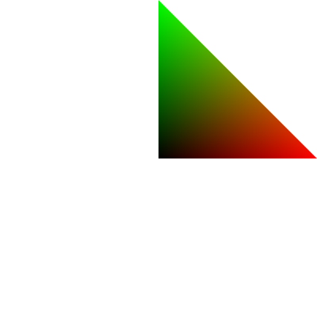

# gluck

This library simplifies WebGL (1.0) programming as much as possible and adds some object oriented convenience to it. While gluck
deals just with native WebGL objects it also augments them with some helper methods.

## Getting started

gluck is imported as an ES6 module which modern browsers support with the `<script>`'s `type="module"` attribute:

```html
<script type="module">
	import webgl from "./gluck/webgl.js";
</script>
```

To create a fresh WebGL context call:

```js
let gl = webgl();
```

An underlying canvas is created automatically. Its width and height falls back to the browsers defaults of 300 and 150 pixels.
To size it to 800x600 pixels give these first 2 arguments:

```js
let gl = webgl(800, 600);
```

Most of the time after creation you would place the canvas somewhere in the DOM but in the simplest case append it to the body.
Just tell gluck to do that with an additional hint:

```js
let gl = webgl(800, 600, "appendToBody");
```

And now we can work with the context. But in WebGL nothing can be drawn without its most essential object: the shader.

```js
let shader = gl.shader("mediump", `
	attribute vec2 pos;
	varying vec2 vpos;
	
	void main()
	{
		gl_Position = vec4(pos, 0, 1);
		vpos = pos;
	}
`,`
	varying vec2 vpos;
	
	void main()
	{
		gl_FragColor = vec4(vpos, 0, 1);
	}
`);
```

The first argument the `gl.shader()` is an optional specifier for the float precision to use. Then follows the vertex and the
fragment shader code. If the code won't compile or link `gl.shader()` will throw and print an error to the Javascript console.

The second essential thing WebGL needs is a vertex buffer that feeds your shader with input data. So here we make one with just
three 2D-vertices forming a triangle:

```js
let buffer = gl.buffer([0,0, 1,0, 0,1]);
```

This creates a "static" buffer holding six 32-bit floating point numbers in it. And that's enough to finally draw
something.

```js
shader.draw(3, {pos: buffer});
```

You tell the shader to draw something processing 3 vertices and feeding the `pos` attribute with values from our buffer. By
default this methods assumes to draw a list of triangles.

And here is the result: a colored triangle:



## Reference

### Integration

gluck is imported as an ES6 module which modern browsers support with the `<script>`'s `type="module"` attribute:

```html
<script type="module">
	import webgl from "./gluck/webgl.js";
</script>
```

### WebGL contexts

```js
let gl = webgl( [width, height] [, canvas] [, options...] );
```

Creates a WebGL context from an existing or automatically created canvas.

* `width`, `height` - the initial size of the canvas and viewport in pixels. natively defaults to `300` and `150`
* `canvas` - the underlying canvas to create a context for if not to be created automatically
* `...options` - the rest of the argument list can be an arbitrary number of hint strings: 
  * a string naming a boolean WebGL context attribute to be enabled. You can look them up
    [here](https://www.khronos.org/registry/webgl/specs/latest/1.0/#WEBGLCONTEXTATTRIBUTES)
  * if you want context attribute to be disabled instead, prefix it with `"no-"` (e.g.: `"no-alpha"` to disable the alpha
    component of the drawing buffer)
  * for the `"powerPreference"` context attribute you can pass one of the following strings:
    * `"highPerformance"` will set `powerPreference = "high-performance"`
    * `"lowPower"` will set `powerPreference = "low-power"`
  * `"appendToBody"` tells gluck to append the canvas to the body after creation

The created context will have enhanced helper methods: `aspect()`

```js
let aspect = gl.aspect();
```

Returns the aspect ratio of the canvas. Nothing else than `gl.canvas.clientWidth / gl.canvas.clientHeight`

### Buffers

```js
let buffer = gl.buffer(["index",] [usage,] [type,] [sizeOrData])
```

Creates a vertex or index buffer with a specified usage pattern and optionally data to be initialised with.

* `"index"` as the first argument will denote this buffer as an index buffer and bind it as an "element array buffer". Otherwise
  it will be a regular vertex buffer and bound as an "array buffer".
* `usage` - might be `"static"`, `"dynamic"` or `"stream"` to describe it's usage hint. Defaults to `"static"` when omitted.
* `type` - data type of the items in the buffer, one of `"float"`, `"byte"`, `"short"`, `"ubyte"`, `"ushort"`
  (for unsigned byte and short integer values). Defaults to `"float"` or `"ushort"` for index buffers. This parameter is only
  helpful if you pass a bare Javascript array as the next parameter so that `buffer()` can cast it properly to a `TypedArray`
  like `Float32Array` or `Uint16Array` e.g.)
* `sizeOrData` - either a `number` of bytes to preallocate for this buffer or an `Array` or some `TypedArray` of items to
  initialize the buffer with.

### Shaders

```js
let shader = gl.shader([precision,] vertexSource, fragmentSource);
```

Compile and link a shader program with the given source text strings for a vertex and a fragment shader, respectively.
